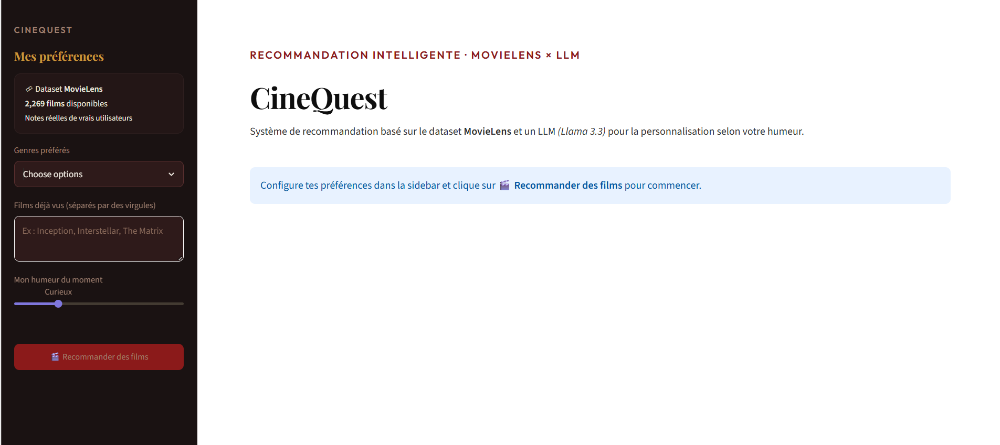
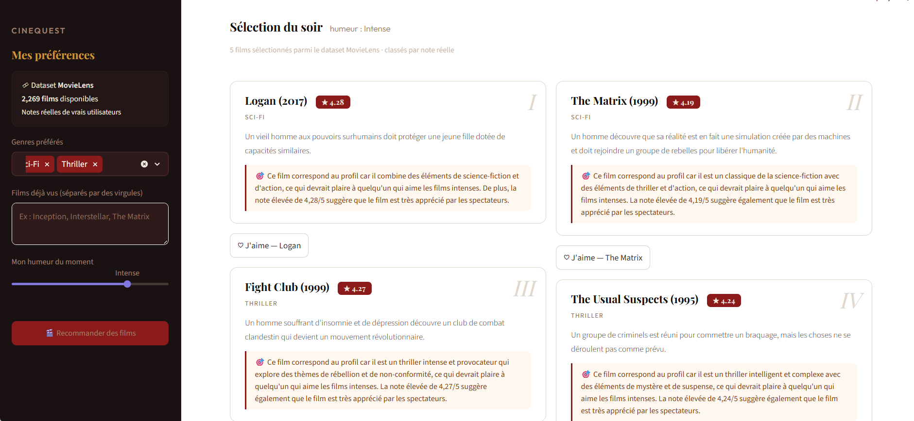
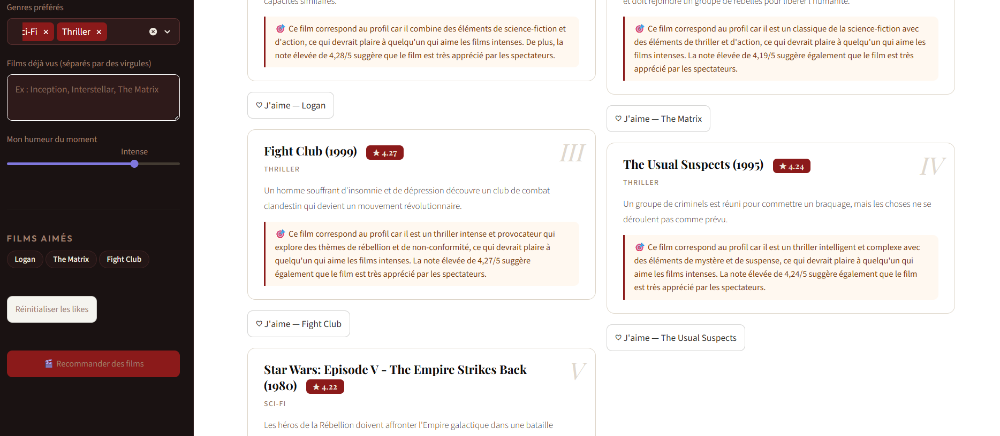

# 🎬 CineQuest — Intelligent Movie Recommendation System

> An AI-powered movie recommendation system combining real MovieLens data with a Large Language Model for personalized, explainable suggestions.

**Student:** Kenza Khenissi  
**Year:** 2nd Year — DAD (Digitalisation et Analyse de Données)  
**School:** ENSTAB — École Nationale des Sciences et Technologies Avancées de Borj Cedria  
**Project:** Individual Project — Generative AI  
**Deadline:** May 31, 2026

---

##  What is CineQuest?

CineQuest is an intelligent movie recommendation system that combines **real data** with **generative AI**:

- Loads **9,000+ real movies** from the MovieLens dataset with real user ratings
- Filters candidates based on your preferred genres and mood
- Sends those real movies to **Llama 3.3 (LLM)** which selects the 5 best matches and explains *why* each film suits your profile
- Learns from your **likes** during the session to refine future recommendations

> This is not a simple chatbot — the LLM reasons over real data, not just its memory.

---

## Generative AI Model Used

**Llama 3.3 70B Versatile** via Groq API — a state-of-the-art open-source Large Language Model used for:

- Personalized recommendation reasoning
- Natural language explanation generation
- Profile-aware film selection from real dataset candidates

---

##  Features

- 🎭 Genre-based filtering (Action, Sci-Fi, Drama, Thriller, and more)
- 🌡️ Mood-aware recommendations (Relaxed, Curious, Adventurous, Intense, Melancholic)
- ⭐ Real MovieLens ratings displayed on each film card
- ❤️ Like system to personalize recommendations within the session
- 🖥️ Clean and responsive web interface built with Streamlit
- 📥 Automatic dataset download on first launch

---

##  Screenshots

### Home Page


### Recommendation Results


### Like System

---
## Demo Video


---


##  Tech Stack

| Component | Technology |
|-----------|------------|
| Web Interface | Streamlit |
| LLM | Llama 3.3 70B via Groq API |
| Dataset | MovieLens Small (9,000+ films) |
| Data Processing | Pandas |
| Language | Python 3.13 |

---

##  Project Structure

```
film-recommender/
├── app.py              # Streamlit web interface
├── recommender.py      # LLM recommendation engine
├── data_loader.py      # MovieLens dataset loader
├── requirements.txt    # Dependencies
├── .env.example        # API key template
├── .streamlit/
│   └── config.toml     # UI theme
├── screenshots/
│   ├── home.png
│   ├── results.png
│   └── likes.png
└── README.md
```

---

##  Installation

```bash
# 1. Clone the repository
git clone https://github.com/kenza125/film-recommender.git
cd film-recommender

# 2. Install dependencies
pip install -r requirements.txt

# 3. Create your .env file
echo "GROQ_API_KEY=your_groq_api_key_here" > .env

# 4. Run the app
streamlit run app.py
```

> Get your free Groq API key at [console.groq.com](https://console.groq.com)

---

##  How It Works

```
User preferences (genres + mood + watch history)
        ↓
Load real MovieLens movies filtered by genre
        ↓
Send top 30 candidates to Llama 3.3 LLM
        ↓
LLM selects 5 best matches + generates explanations
        ↓
Display results with real ratings and personalized reasons
```

---

##  Students

| Name | School | Year |
|------|--------|------|
| Kenza Khenissi | ENSTAB | 2nd Year DAD |

---

##  Dataset

This project uses the [MovieLens Small Dataset](https://grouplens.org/datasets/movielens/latest/) provided by GroupLens Research — University of Minnesota.

> F. Maxwell Harper and Joseph A. Konstan. 2015. The MovieLens Datasets. ACM Transactions on Interactive Intelligent Systems.
